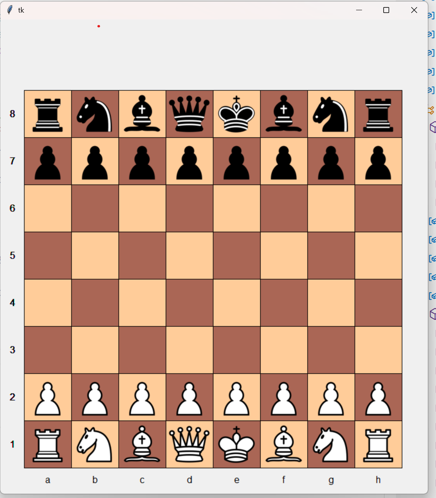

# Chess notes
## Introduction
I started this work to explore working with chess in the programming world.  My intention was not to compeate
with the major chess programms available. My inspiration was my friend John's Java Script program to display some simple
chess checkmate examples.  I'm still humbled by the fact that his whole program is executable directly from my email!
My first progress was the display of chessboard positions.  The input consists of the, incomplete, FEN chess notation.  Showing that
"lazyness is the mother of invention", I added support for a few pieces on the board, e.g., ':Kc1Qe1kh7 w' for white king at c1,
white queen at e1, black king at h7 with white to move.

## Goals
My intention is to develop some tools to interpret, execute, and display chess games/situations.  While not striving to produce
chess machinery, I hope to experiment a lot.  With the potential of producing serious chess machinery
with resonable display capabilities, I hope to separate display from execution.  I hope to provide support for the blind,
similar to my work in 

### Some views
Current display code uses Python's tkinter module.  In the future I plan to migrate
to wxPython, mainly because wxPython is more compatible with todays screen readers
such as JAWS and NVDIA.  My guess is that tkinter predates the modern APIs that aid
screen readers and other accessibility code which benefits the blind.
#### Chess Board Display

## Chess Attributes Views
Although the game of chess is intertwined with different aspects we
can divide to conquer.   The following divisions have been helpful to me.

### Notation - Computer input and output
It is often helpful to facilitate the input and output of chess moves and positions.
We will restrict ourselves to what is termed algebraic notation.
* squares: <lowercase letter a-h
   denoting file (column) 1-8 from left to right from white's view>
   <digit 1-8 denoting rank (row) from bottom to top fom white's view>
   - a1 - white square at left, lower corner of board from white's view
   - h8 - white square at right, upper corner of board from whites view
* piece in square:
  - letter k,q,r,b,n,p for black king,queen,rook,knight,pawn
  -        K,Q,R,B,N,P for white king,queen,rook,knight,pawn
    - Ka1 - white king at square a1
    - ka1 - black king at square a1
* chess move: <Upper case piece K,Q,R,B,N,P><destination square>
  - Kf1 - king moves to f1. (color is determined by who (white or black) is movine
* chess move abreviations: specification is usually abreviated
  - In pawn moves the the explicit piece letter is omitted
  - The orig square is omitted and determined by what piece(s) can move to
    the destination.
  - If more than one piece of the specified type and
    current color can move to the destination, file/rank specifications,
    following the Piece letter are used.

###  Board physics
The board contents and opperation should be distinct from the display because
in chess, one often needs to have insight about board positions that never
occurr or are displayed.  For example one might want to know all the possible
moves a piece can make, so as to pick the most advantageous one.
We place most of this operation in a class **Chessboard**, residing in chessboard.py.
This class contains the initial piece setup, the current board pieces and their
locations, which pieces have moved, history of moves to support "undo" or aid
checking for enpasant.

#### Piece Movement
As a subsection of "Board Physics" we consider chess piece movement.  We encapsulate
this in the class **ChessPieceMovement**, contained in chess_piece_movement.py.  This
class's most visible function is **get_move_to_sqs**, which returns all the squares
to which a particular piece may move, including any possible captures.  Note that
as in other partitioned systems, this function often has to refer to external
objects such as the Chessboard.

#### Move Notation
Because chess move notation is so visible in the process of playing and displaying
chess we have placed our notational move parsing in a class **ChessMoveNotation**.
The primary functions used in parsing a move specification are **decode_spec_parts**
and **decode_complete**.  The function **decode_spec_parts** parses out what can be done with little or no knowledge of the board status  The function **decode_complete** takes the
results of **decode_spec_parts**, plus board knowledge and completes the move spec
parsing.
# resource_lib
## Common files / support for other projects
Contains files used to support other projects.
Provides logging, tracing, properties support.

## Brief listing of document files (Docs directory)
- Program_Logging_Tracing.pptx PowerPoint presentation about Logging/Tracing demonstrating the classes SlTrace and TraceControlWindow
## Brief listing of source files (src directory) with purpose.
- select_error.py General local, to our program/game, error class
- select_trace.py class SlTrace
  * trace/logging package
  * derived from smTrace.java (ours)
  * properties file support
